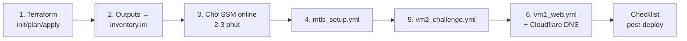

# 06 — Deployment Pipeline & Rollback

> Nguồn sự thật: `docs/aws/01-aws-infrastructure.md`, `terraform/aws/`, `ansible/`

## Pipeline 6 bước (thứ tự bắt buộc)



| Bước | Lệnh | Gate |
|---|---|---|
| 1 | `terraform -chdir=terraform/aws init && plan && apply -var-file=terraform.tfvars` | review plan diff; RDS mất 10-15 phút |
| 2 | `terraform output` → điền `ansible/aws/inventory.ini` từ `.example` | IP đúng, không commit file này |
| 3 | `aws ssm describe-instance-information --filters Key=InstanceIds,Values=<vm1_id>` | PingStatus = Online |
| 4 | `ansible-playbook -i ansible/aws/inventory.ini ansible/common/mtls_setup.yml` | dry-run `-C --diff` trước |
| 5 | `ansible-playbook -i ansible/aws/inventory.ini ansible/common/vm2_challenge.yml` | K3s node Ready |
| 6 | `ansible-playbook -i ansible/aws/inventory.ini ansible/aws/vm1_web.yml` + Cloudflare A record → VM1 IP | HTTPS xanh, login được |

## Quy tắc thay đổi cấu hình sau deploy

- **Theme/template**: upload file → copy vào `/opt/ctfd/themes/...` → `redis-cli FLUSHALL` (bắt buộc) — command `/aws-theme-deploy`.
- **Compose/stack**: sửa qua playbook rồi re-run `vm1_web.yml` (idempotent) — không sửa tay trên VM (drift).
- **Terraform**: chỉ khi resource-level (instance type, SG...). Sau khi sửa tay trên AWS console bất kể lý do gì → chạy `terraform plan` ngay để sync drift.

## Rollback

| Tầng | Cách |
|---|---|
| Terraform | `git revert` file .tf → `plan` (diff chỉ còn rollback) → `apply` |
| Ansible | re-run playbook cũ qua `git checkout <commit> -- ansible/` |
| CTFd app | trên VM1: `docker compose down && docker compose up -d --build` sau khi checkout image/theme cũ |
| DB (RDS) | PITR restore đến timestamp trước sự cố → đổi endpoint trong SSM |
| DB (container) | restore từ `/opt/ctfd/postgres` volume snapshot / pg_dump gần nhất |

## Drift detection định kỳ

```bash
terraform -chdir=terraform/aws plan -var-file=terraform.tfvars
```
Có diff ngoài mong đợi = ai đó đã sửa console — reconcile trước khi làm việc khác.
