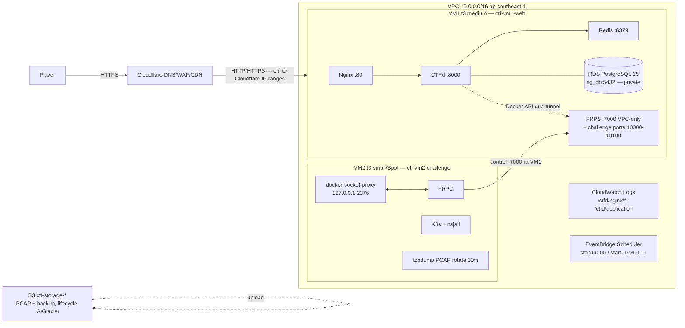

# Kiến trúc AWS — CyberKnight CTFd

## Sơ đồ logic (traffic flow)

## Ánh xạ resource → file

| Resource AWS | Định nghĩa Terraform | Cấu hình runtime (Ansible) |
|---|---|---|
| VPC `ctf-vpc` + IGW + route | `terraform/aws/network.tf` | — |
| Public subnets 2 AZ (10.0.1.0/24, 10.0.2.0/24) | `network.tf` | — |
| SG web (80/443 chỉ Cloudflare, 7000 VPC-only, 10000-10100 public) | `network.tf` | — |
| SG challenge (zero-inbound, egress all) | `network.tf` | — |
| SG db (5432 chỉ từ sg_web) | `network.tf` | — |
| VM1 EC2 Ubuntu 22.04 t3.medium, IMDSv2 required, hop-limit 1 | `compute.tf` `aws_instance.vm1_web` | `ansible/aws/vm1_web.yml` |
| VM2 EC2 t3.small (Spot khi practice) | `compute.tf` `aws_instance.vm2_challenge` | `ansible/common/vm2_challenge.yml` |
| IAM role `ctf-vm-role` (SSM core, CloudWatch agent, SSM read) | `compute.tf` | — |
| RDS PostgreSQL 15 `ctf-postgres` db.t3.micro, encrypted, private | `database.tf` | *(hiện chưa được playbook dùng — xem lưu ý)* |
| SSM `/ctfd/database-url` SecureString | `database.tf` `aws_ssm_parameter.db_url` | đọc bằng `aws ssm get-parameter` |
| S3 `ctf-storage-<rand>` block-public + AES256 + lifecycle | `storage_and_automation.tf` | tcpdump rotate trên VM2 |
| EventBridge stop-vm2 00:00 ICT / start-vm2 07:30 ICT | `storage_and_automation.tf` | — |
| CloudWatch Agent + log groups | — | trong `ansible/aws/vm1_web.yml` |

## Quyết định thiết kế then chốt (why)

1. **IMDSv2 bắt buộc + hop-limit 1** — CTF có Web Exploitation; SSRF phải không đọc được IAM credentials từ metadata.
2. **SG web chỉ nhận Cloudflare** — chặn scan trực tiếp vào origin IP; origin ẩn sau proxy.
3. **VM2 zero-inbound + FRP tunnel** — Docker API không bao giờ public; CTFd (VM1) gọi Docker API của VM2 qua kênh FRPS:7000 mã hoá, dashboard FRP 7400 loopback.
4. **RDS private + SG từ sg_web** — DB không có IP public.
5. **Spot VM2 + EventBridge on/off** — chi phí luyện tập giảm ~70%; trước thi đấu đổi `is_practice_mode=false`.

## ⚠️ Lệch pha hiện tại giữa Terraform và Ansible

Terraform provision RDS + SSM `/ctfd/database-url`, nhưng `ansible/aws/vm1_web.yml`
đang chạy **PostgreSQL container ngay trên VM1** (`DATABASE_URL=postgresql://ctfd:{{ db_password }}@db:5432/ctfd`).
Hai phương án khi deploy:

- **A — giữ playbook nguyên trạng**: PostgreSQL chạy container, bỏ qua RDS (nhưng vẫn trả tiền RDS! → set `count=0`/comment RDS nếu không dùng).
- **B — chuyển sang RDS**: sửa playbook inject `DATABASE_URL` từ SSM (`aws ssm get-parameter --name /ctfd/database-url --with-decryption`), xoá service `db` khỏi compose.

Hỏi user chọn phương án nào trước khi deploy. Chi tiết: `.claude/architecture/03-data-and-storage.md`.
