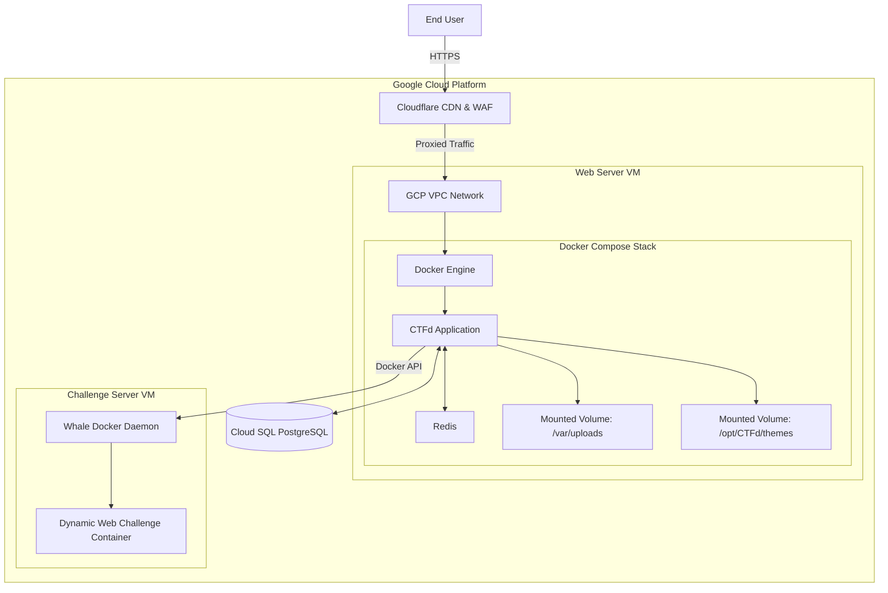

# CyberKnight Weekly Game 2026 - Web Exploitation

## Overview

**CyberKnight Weekly Game 2026** is the official infrastructure and challenge repository for the CyberKnight Core Team's internal Web Exploitation Capture The Flag (CTF) competition. 

This repository contains the complete Infrastructure as Code (IaC) setup, custom themes, and the source code for all web challenges used during the event. It is designed to be easily reproducible and deployable.

## Repository Structure

*   `terraform/`: Contains Terraform configuration files to provision Google Cloud Platform (GCP) resources (Compute Engine, VPCs, Firewall rules, Cloud SQL).
*   `ansible/`: Ansible playbooks for automated server configuration, Docker installation, and CTFd deployment.
*   `challenges/`: Source code and Docker configurations for all Web Exploitation challenges (including CTFd Whale dynamic container integrations).
*   `themes/`: Custom CTFd UI themes, specifically the `ctfd-theme-neubrutalism` built for the event's unique branding.
*   `docs/`: Architecture diagrams and additional documentation.
*   `backups/`: Contains the final database exports and server configuration backups after the conclusion of the event.

## Deployment Architecture

The platform was designed to be deployed on Google Cloud Platform (GCP) and features:
*   **Edge Network:** Cloudflare for DNS, WAF, and DDoS protection.
*   **Application Stack:** CTFd running via Docker Compose (Web server, Redis cache).
*   **Database:** Configured to use an external relational database for persistence.
*   **Dynamic Challenges:** Integrated with CTFd Whale to spawn isolated Docker containers for each participant per web challenge.

## Setup Instructions

1.  **Provision Infrastructure:** Navigate to `terraform/` and run `terraform apply` to create the cloud resources.
2.  **Configure Servers:** Update the Ansible inventory and run the playbooks in `ansible/` to configure the servers and start CTFd.
3.  **Deploy Challenges:** Use the configurations in `challenges/` to build and push challenge images, then sync them with the CTFd platform.

## Security & Access Control

*   Registration is strictly limited to institutional domains (`tdtu.edu.vn`, `student.tdtu.edu.vn`).
*   The default CTFd interface was heavily modified for internal branding.
*   Uploads and local file systems are secured with strict permission controls.

## Credits
Developed and maintained by the **CyberKnight Core Team**.
© 2025-2026 CyberKnight Team. All rights reserved.
