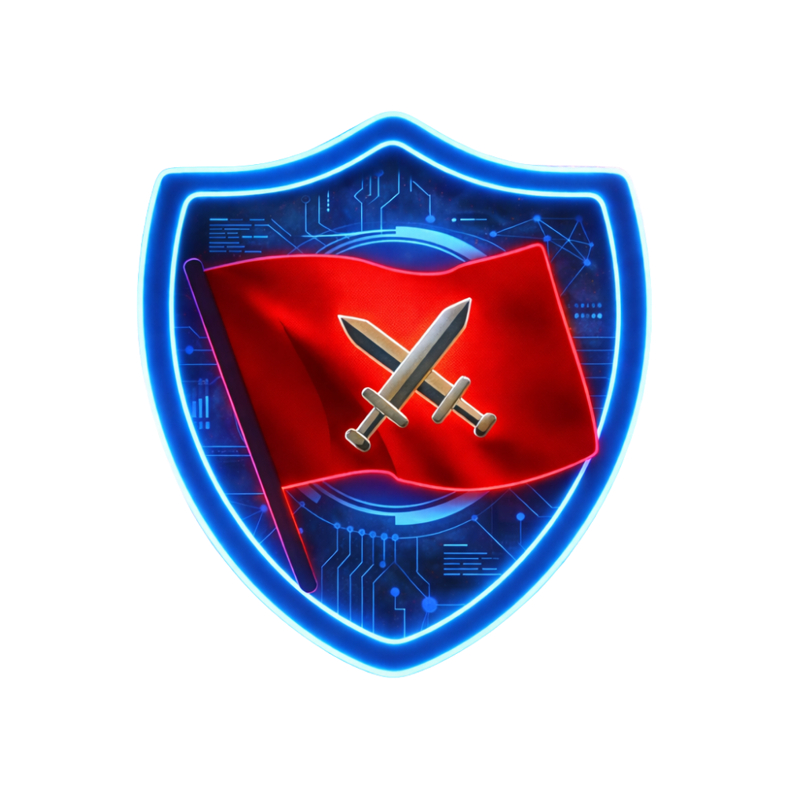

<div align="center">



# CyberKnight Weekly Game 2026

**Internal CTF Platform — CyberKnight Core Team**


</div>

---

## Overview

**CyberKnight Weekly Game 2026** is the official weekly CTF (Capture The Flag) platform maintained exclusively for the **CyberKnight Core Team** — the internal cybersecurity group at **Ton Duc Thang University (TDTU)**.

Competitions are held on a weekly basis to develop real-world offensive and defensive security skills across multiple technical disciplines.

This repository contains the complete **Infrastructure as Code (IaC)**, server configuration, custom CTFd theme, and challenge source code — designed to be deployed independently on either **Google Cloud Platform (GCP)** or **Amazon Web Services (AWS)**.

---

## Challenge Categories

| Category | Description |
|---|---|
| 🌐 **Web Exploitation** | SQL Injection, XSS, SSRF, IDOR, LFI/RFI, OAuth, JWT, Deserialization, Business Logic... |
| 💥 **PWN / Binary Exploitation** | Buffer Overflow, ROP Chains, Heap Exploitation, Format String, Use-After-Free, Kernel PWN... |
| 🔍 **Reverse Engineering** | Static & Dynamic Analysis, Anti-debug Bypass, Crackme, Obfuscated Code, Firmware... |
| 🔐 **Cryptography** | Classical Ciphers, RSA, AES/ECB, Elliptic Curve, Hash Collision, Side-channel Attacks... |
| 🕵️ **Forensics / DFIR** | Memory Dump, Disk Imaging, Network PCAP, Log Analysis, Steganography, Timeline Analysis... |
| 👁️ **OSINT** | Open Source Intelligence, Social Engineering, Geolocation, Metadata Analysis... |
| 🎲 **Miscellaneous / Jail** | Pyjail, Bash Jail, Logic Puzzles, Esoteric Languages, Sandboxing... |

---

## Repository Structure

```
ctfd-platform-2026/
│
├── 📁 terraform/
│   ├── gcp/                     # Terraform for Google Cloud Platform
│   │   ├── provider.tf
│   │   ├── variables.tf
│   │   ├── network.tf           # VPC, Subnet, Firewall rules, IAP SSH access
│   │   ├── compute.tf           # Compute Engine VM1 (e2-medium) & VM2 (e2-standard-2 Spot)
│   │   ├── database.tf          # Cloud SQL PostgreSQL 15 + Secret Manager
│   │   ├── storage_and_automation.tf  # GCS Bucket + Cloud Scheduler (auto start/stop VM2)
│   │   └── outputs.tf
│   │
│   └── aws/                     # Terraform for Amazon Web Services
│       ├── provider.tf
│       ├── variables.tf
│       ├── network.tf           # VPC, Subnets (2 AZs), Security Groups
│       ├── compute.tf           # EC2 t3.medium & t3.large (Spot), IAM Role, IMDSv2 hardening
│       ├── database.tf          # RDS PostgreSQL 15 + SSM Parameter Store (SecureString)
│       ├── storage_and_automation.tf  # S3 Bucket + EventBridge Scheduler
│       └── outputs.tf
│
├── 📁 ansible/
│   ├── gcp/                     # GCP-specific playbooks
│   │   ├── vm1_web.yml          # CTFd + Nginx + Redis + Google Cloud Ops Agent
│   │   └── inventory.ini.example
│   ├── aws/                     # AWS-specific playbooks
│   │   ├── vm1_web.yml          # CTFd + Nginx + Redis + CloudWatch Agent + SSM integration
│   │   └── inventory.ini.example
│   └── common/                  # Cloud-agnostic shared playbooks
│       ├── mtls_setup.yml       # Distribute mTLS certificates between VM1 and VM2
│       └── vm2_challenge.yml    # Docker Socket Proxy + K3s + tcpdump PCAP rotation
│
├── 📁 challenges/
│   └── k8s/                     # Kubernetes manifests for dynamic challenges
│       ├── network_policy.yaml  # NetworkPolicy to isolate containers (prevent reverse shells)
│       └── nsjail_pod.yaml      # Pod spec with nsjail sandbox
│
├── 📁 themes/
│   └── ctfd-theme-neubrutalism/ # Custom CTFd UI theme (Vite + SCSS + Vanilla JS)
│
└── 📁 docs/
    ├── gcp/
    │   ├── 01-gcp-infrastructure.md    # GCP deployment & operations guide
    │   └── 02-gcp-troubleshooting.md  # GCP troubleshooting & common fixes
    ├── aws/
    │   ├── 01-aws-infrastructure.md    # AWS deployment & operations guide
    │   └── 02-aws-troubleshooting.md  # AWS troubleshooting & common fixes
    └── common/
        ├── 01-theme-and-frontend.md    # Theme customization, Alpine.js → Vanilla JS
        ├── 02-ctfd-and-api-quirks.md   # CTFd configuration, SMTP, API quirks
        └── 03-challenges-k8s.md        # Dynamic challenges, K3s, nsjail, PCAP analysis
```

---

## Deployment Architecture

```
[Participant] ──HTTPS──► [Cloudflare CDN & WAF]
                                  │
                    ┌─────────────▼─────────────┐
                    │   Cloud Platform           │
                    │   (GCP  or  AWS)           │
                    │                            │
                    │  ┌──────────────────────┐  │
                    │  │   VM1 — Web Server   │  │
                    │  │   Nginx :80          │  │
                    │  │   CTFd  :8000        │  │
                    │  │   Redis :6379        │  │
                    │  └──────────┬───────────┘  │
                    │             │ Private Only   │
                    │  ┌──────────▼───────────┐  │
                    │  │  PostgreSQL Database  │  │
                    │  │  (Cloud SQL / RDS)   │  │
                    │  └──────────────────────┘  │
                    │             │ mTLS :2376     │
                    │  ┌──────────▼───────────┐  │
                    │  │  VM2 — Challenge     │  │
                    │  │  Docker Socket Proxy  │  │
                    │  │  K3s Kubernetes       │  │
                    │  │  nsjail Sandbox       │  │
                    │  │  tcpdump PCAP Capture │  │
                    │  └──────────────────────┘  │
                    └────────────────────────────┘
```

---

## Quick Start

### Prerequisites (both clouds)

1. Install **Terraform** ≥ 1.5, **Ansible** ≥ 2.12, **AWS CLI v2** or **gcloud CLI**.
2. Create a `terraform.tfvars` file in the relevant terraform directory:
   ```hcl
   db_password = "StrongPassword@2026!"
   ctf_domain  = "cyberknightgame.site"
   ```
3. Generate **mTLS certificates** — see [docs/common/03-challenges-k8s.md](docs/common/03-challenges-k8s.md).

---

### 🟦 Deploy on GCP

```bash
# 1. Provision infrastructure
cd terraform/gcp
terraform init
terraform apply -var-file="terraform.tfvars"

# 2. Set up Ansible inventory with IPs from: terraform output
cp ansible/gcp/inventory.ini.example ansible/gcp/inventory.ini

# 3. Run playbooks in order
ansible-playbook -i ansible/gcp/inventory.ini ansible/common/mtls_setup.yml
ansible-playbook -i ansible/gcp/inventory.ini ansible/common/vm2_challenge.yml
ansible-playbook -i ansible/gcp/inventory.ini ansible/gcp/vm1_web.yml
```

📖 Full guide: [docs/gcp/01-gcp-infrastructure.md](docs/gcp/01-gcp-infrastructure.md)

---

### 🟧 Deploy on AWS

```bash
# 1. Provision infrastructure
cd terraform/aws
terraform init
terraform apply -var-file="terraform.tfvars"

# 2. Set up Ansible inventory with IPs from: terraform output
cp ansible/aws/inventory.ini.example ansible/aws/inventory.ini

# 3. Run playbooks in order
ansible-playbook -i ansible/aws/inventory.ini ansible/common/mtls_setup.yml
ansible-playbook -i ansible/aws/inventory.ini ansible/common/vm2_challenge.yml
ansible-playbook -i ansible/aws/inventory.ini ansible/aws/vm1_web.yml
```

📖 Full guide: [docs/aws/01-aws-infrastructure.md](docs/aws/01-aws-infrastructure.md)

---

## GCP vs AWS — Comparison

| | 🟦 GCP | 🟧 AWS |
|---|---|---|
| **Web Server VM** | Compute Engine `e2-medium` | EC2 `t3.medium` |
| **Challenge VM** | Compute Engine `e2-standard-2` (Spot) | EC2 `t3.large` (Spot) |
| **Database** | Cloud SQL PostgreSQL 15 | RDS PostgreSQL 15 |
| **Object Storage** | Google Cloud Storage (GCS) | Amazon S3 |
| **Secret Storage** | GCP Secret Manager | SSM Parameter Store (SecureString) |
| **Monitoring / Logs** | Cloud Ops Agent → Cloud Logging | CloudWatch Agent → CloudWatch Logs |
| **SSH Access** | Identity-Aware Proxy (IAP) | SSM Session Manager (no port 22 needed) |
| **VM2 Auto On/Off** | Cloud Scheduler | EventBridge Scheduler |
| **Estimated Cost** | ~$28/month | ~$60/month |

---

## Security Hardening

| Layer | Measure |
|---|---|
| **Edge** | Cloudflare WAF, DDoS protection, SSL/TLS termination |
| **Network** | Firewall / Security Groups — only Cloudflare IPs allowed on HTTP/HTTPS |
| **VM-to-VM** | Mutual TLS (mTLS) on Docker API port 2376 |
| **AWS Metadata** | IMDSv2 enforced (`http_tokens = required`) — prevents SSRF IAM credential leakage |
| **Challenge Isolation** | K3s NetworkPolicy (deny all egress) + nsjail sandbox |
| **Database** | No public IP — private VPC access only from VM1 |
| **Registration** | Domain whitelist: `tdtu.edu.vn`, `student.tdtu.edu.vn` only |

---

## Tech Stack

| Layer | Technology |
|---|---|
| CTF Platform | [CTFd](https://ctfd.io) (self-hosted) |
| Theme | Custom `ctfd-theme-neubrutalism` (Vite + SCSS + Vanilla JS) |
| Containerization | Docker, Docker Compose |
| Orchestration | K3s (Lightweight Kubernetes) |
| Challenge Sandbox | nsjail, Docker Socket Proxy (mTLS) |
| Traffic Capture | tcpdump (systemd rotation service) |
| Infrastructure as Code | Terraform (GCP provider & AWS provider) |
| Configuration Management | Ansible |
| Edge / CDN | Cloudflare (DNS, WAF, DDoS, SSL) |
| Database | PostgreSQL 15 |
| Cache | Redis 4 |
| Reverse Proxy | Nginx |

---

## Documentation

| Document | Description |
|---|---|
| [docs/gcp/01-gcp-infrastructure.md](docs/gcp/01-gcp-infrastructure.md) | GCP deployment, operations, and cost breakdown |
| [docs/gcp/02-gcp-troubleshooting.md](docs/gcp/02-gcp-troubleshooting.md) | GCP troubleshooting and `gcloud` command reference |
| [docs/aws/01-aws-infrastructure.md](docs/aws/01-aws-infrastructure.md) | AWS deployment, operations, and cost breakdown |
| [docs/aws/02-aws-troubleshooting.md](docs/aws/02-aws-troubleshooting.md) | AWS troubleshooting, AWS CLI and SSM reference |
| [docs/common/01-theme-and-frontend.md](docs/common/01-theme-and-frontend.md) | Theme customization, Alpine.js → Vanilla JS migration |
| [docs/common/02-ctfd-and-api-quirks.md](docs/common/02-ctfd-and-api-quirks.md) | CTFd configuration, SMTP, file upload, API quirks |
| [docs/common/03-challenges-k8s.md](docs/common/03-challenges-k8s.md) | Dynamic challenges, K3s management, nsjail, PCAP |

---

## Credits

Developed and maintained by the **CyberKnight Core Team**.

> *"Hack to learn, learn to hack."*

© 2025–2026 CyberKnight Team — Ton Duc Thang University. All rights reserved.
